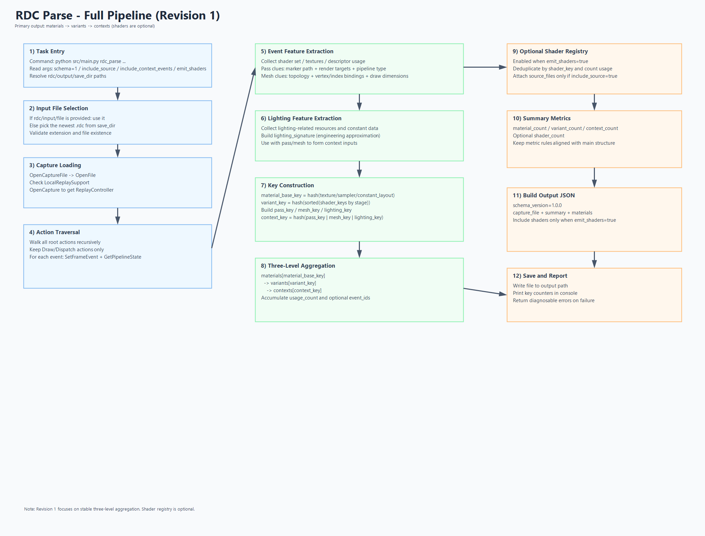

# RenderDoc-Python-Test

基于 Python + RenderDoc 的自动化工具仓库，覆盖两类核心能力：

- 远程启动与截帧（Android / ADB）
- `.rdc` 解析与结构化落盘（Material / Texture / Shader / Pass）

当前解析契约版本：`schema_version=1.5.0`。

---

## 1. 项目特性

- 单文件 `.rdc` 解析，默认输出到 `output/<capture_name>/`
- `rdc_entry.json` 作为统一入口，索引四类实体
- Texture / Shader 重资产可独立开关导出
- 纹理 PNG 自动去重（共享目录）
- Shader 源码自动去重（共享目录）
- 索引项附带 `sha256`，方便平台做增量上报和校验

---

## 2. 目录结构

```text
RenderDoc-Python-Test/
├─ src/
│  ├─ main.py
│  ├─ capture/
│  │  └─ remote_object.py
│  ├─ common/
│  │  ├─ global_config.py
│  │  └─ command_type.py
│  ├─ parse/
│  │  ├─ rdc_parse_pipeline.py
│  │  ├─ rdc_parser.py
│  │  └─ modules/
│  │     ├─ material_module.py
│  │     ├─ texture_module.py
│  │     ├─ shader_module.py
│  │     └─ pass_module.py
│  └─ task/
│     ├─ task_manager.py
│     ├─ cmd_task.py
│     ├─ parse_rdc_task.py
│     ├─ rename_rdc_task.py
│     └─ tcp_server_task.py
├─ docs/
│  ├─ rdc_parse.md
│  └─ assets/
├─ include/
├─ lib/
├─ save/
├─ output/
├─ config.ini
└─ README.md
```

---

## 3. 环境要求

- Python `3.10+`
- Git（若仓库含 LFS 资源，需安装 Git LFS）
- Android 场景需安装 `adb` 并可正常连接设备

说明：

- 仓库已包含 RenderDoc Python 绑定与对应动态库目录（`lib/`、`include/`）
- 启动入口会自动配置 Python 运行时库路径

---

## 4. 安装与准备

```bash
git clone <repo_url>
cd RenderDoc-Python-Test
```

如需拉取 LFS 资源：

```bash
git lfs install
git lfs pull
```

---

## 5. 配置文件

配置文件路径：`config.ini`

示例：

```ini
[path]
save_dir_abs =

[Network]
listen_port = 16688
listen_host = 127.0.0.1

[Android]
package_name = com.tencent.mho
activity_name = com.epicgames.unreal.SplashActivity
device_serial =

[Task]
default_task_id = cmd
default_task_params =
```

关键项：

- `path.save_dir_abs`：默认截帧保存目录；为空时使用 `<repo>/save`
- `Network.listen_host / listen_port`：TCP Server 监听地址
- `Android.package_name / activity_name`：目标 App 启动入口
- `Android.device_serial`：指定设备序列号；为空时使用首个可用设备
- `Task.default_task_id`：无子命令时默认任务（默认 `cmd`）

---

## 6. 快速开始

命令格式：

```bash
python src/main.py <task_id> key=value key=value ...
```

### 6.1 控制台模式（默认）

```bash
python src/main.py
```

进入交互后可用命令：

- `rdc`：启动 RenderDoc remote server
- `app`：启动目标 App 并注入
- `cap [name]`：触发截帧
- `exit`：退出

### 6.2 解析 RDC（核心）

任务名：`rdc_parse`（兼容别名：`parse_rdc`）

```bash
python src/main.py rdc_parse rdc=save/1.rdc
```

可选参数：

- `rdc` / `input` / `file`：输入 `.rdc` 文件路径
- `save_dir`：当未指定 `rdc` 时，从该目录选择最新 `.rdc`
- `export_texture_assets=true|false`：是否导出纹理 PNG（默认 `true`）
- `export_shader_assets=true|false`：是否导出 Shader 源码（默认 `true`）
- `include_context_events=true|false`：预留参数（当前不进入 artifacts 模型）

示例：

```bash
python src/main.py rdc_parse rdc=save/1.rdc export_texture_assets=true export_shader_assets=true
python src/main.py rdc_parse rdc=save/1.rdc export_texture_assets=false export_shader_assets=true
python src/main.py rdc_parse save_dir=save
```

### 6.3 批量重命名 RDC

任务名：`rename_rdc`（兼容别名：`rdc_rename`）

```bash
python src/main.py rename_rdc save_dir=save
```

会按文件名后缀数字排序并重命名为：`1.rdc, 2.rdc, ...`

### 6.4 TCP Server 模式

任务名：`server`

```bash
python src/main.py server
```

默认监听 `127.0.0.1:16688`，指令枚举定义在 `src/common/command_type.py`：

- `0` `Launch_RDC`
- `1` `Launch_APP`
- `2` `APP_CAPTURE`
- `3` `CLOSE_CONNNET`
- `4` `SET_DIR`
- `5` `SET_DEVICE_SERIAL`

---

## 7. RDC 解析输出

输入 `xxx.rdc` 后，输出目录固定为：

```text
output/xxx/
├─ rdc_entry.json
├─ rdc_material/
│  └─ .../rdc_material.json
├─ rdc_texture/
│  ├─ _shared_images/
│  └─ .../rdc_texture.json
├─ rdc_shader/
│  ├─ _shared_sources/
│  └─ .../rdc_shader.json
└─ rdc_pass/
   └─ .../rdc_pass.json
```

说明：

- `rdc_entry.json`：统一入口（`capture_file`、`summary`、`artifacts`）
- `rdc_texture/_shared_images`：纹理 PNG 按内容哈希去重
- `rdc_shader/_shared_sources`：Shader 源码按内容哈希去重
- 各实体目录中 JSON 为主数据，重资产文件通过相对路径引用

完整字段定义与示例请看：

- [docs/rdc_parse.md](docs/rdc_parse.md)

流程图：

- 

---

## 8. 扩展开发建议

解析框架已按模块拆分，新增能力建议按“实体模块 + 编排层接线”实现：

- `src/parse/modules/material_module.py`
- `src/parse/modules/texture_module.py`
- `src/parse/modules/shader_module.py`
- `src/parse/modules/pass_module.py`
- `src/parse/rdc_parse_pipeline.py`

建议保持：

- 实体模块负责 `extract_* / persist_*`
- 编排层只负责遍历 action、关系聚合、索引写入

---

## 9. 常见问题

### 9.1 `import renderdoc` 失败

- 确认通过 `python src/main.py ...` 启动（会自动执行环境初始化）
- 检查 `lib/<platform>` 是否完整

### 9.2 找不到 `.rdc` 文件

- 显式传入：`rdc=<path>`
- 或检查 `save_dir` 与 `config.ini` 中 `path.save_dir_abs`

### 9.3 纹理图片未导出

- 检查是否设置了 `export_texture_assets=false`
- 查看 `rdc_entry.json.summary.texture_export_error_count`
- 查看对应 `rdc_texture.json` 的 `export_error`

### 9.4 Material 的 `pass_channels / material_instance_names / mesh_names` 为空

- 这类字段来自 marker 解析，依赖 capture 内标记质量
- 计算/清理类 pass 往往无法稳定给出材质语义，出现空值是预期行为之一

---

## 10. 相关文档

- 解析契约与完整字段：`docs/rdc_parse.md`
- 解析流程图：`docs/assets/rdc_parse_flow_overview.png`
- 任务实现入口：`src/task/`

