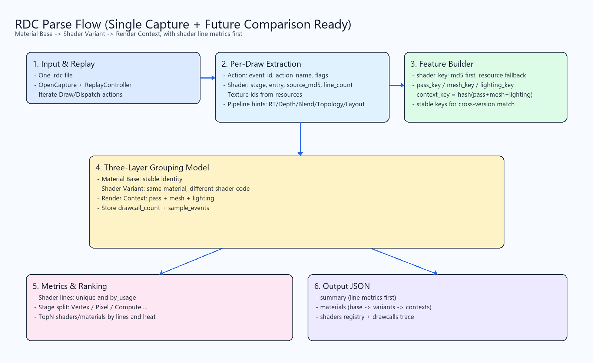

# RDC Parse 整体方案（单文件分析 + 多版本对比）

## 0. 文档约定
- 后续关于 `rdc_parse` 的方案、结构设计、字段定义，统一更新到本文件。
- 方案变更时，先更新本文件中的 JSON 结构和版本策略，再改代码。
- 若新增输出字段，必须补充字段含义与兼容策略。

---

## 1. 当前目标（单文件）
聚焦**单个 `.rdc` 文件**，目前只分析材质与 Shader 相关信息。

输出文件默认放在 `output/rdc_material_shader.json`。

---

## 2. 整体流程图

### 2.1 推荐展示




---

## 3. 三层模型说明

1. `Material Base`
- 目标：表达“同一个材质”的稳定身份。
- 作用：将同材质在不同渲染条件下的表现聚合到同一实体。

2. `Shader Variant`
- 目标：表达同材质下不同 Shader 代码版本。
- 作用：对比不同 pass/mesh/光照下的代码差异与行数差异。

3. `Render Context`
- 目标：解释某个变体出现的上下文。
- 作用：定位到 `pass_key + mesh_key + lighting_key` 场景。

---

## 4. JSON 结构（单文件建议版）

```json
{
  "capture_file": "1.rdc",
  "summary": {
    "material_count": 0,
    "shader_count": 0,
    "shader_total_lines_unique": 0,
    "shader_total_lines_by_usage": 0,
    "shader_stage_line_counts_unique": {
      "Vertex": 0,
      "Pixel": 0,
      "Compute": 0
    },
    "shader_stage_line_counts_by_usage": {
      "Vertex": 0,
      "Pixel": 0,
      "Compute": 0
    },
    "top_shaders_by_lines": [
      {
        "shader_key": "md5:...",
        "stage": "Pixel",
        "entry_point": "main",
        "source_line_count": 0,
        "usage_count": 0
      }
    ]
  },
  "materials": [
    {
      "material_base_key": "mat:...",
      "base_features": {
        "primary_textures": ["ResourceId::..."],
        "sampler_signature": "...",
        "constant_layout_signature": "..."
      },
      "variants": [
        {
          "variant_key": "var:...",
          "shader_keys": ["md5:vs...", "md5:ps..."],
          "shader_lines": {
            "unique": 0,
            "by_usage": 0,
            "by_stage": {
              "Vertex": 0,
              "Pixel": 0,
              "Compute": 0
            }
          },
          "contexts": [
            {
              "context_key": "ctx:...",
              "pass_key": "...",
              "mesh_key": "...",
              "lighting_key": "...",
              "usage_count": 0
            }
          ]
        }
      ]
    }
  ],
  "shaders": [
    {
      "shader_key": "md5:...",
      "stage": "Pixel",
      "entry_point": "main",
      "resource_id": "ResourceId::...",
      "resource_name": "...",
      "source_md5": "...",
      "source_line_count": 0,
      "source_file_count": 0,
      "source_files": [
        {
          "filename": "...",
          "line_count": 0,
          "content": "(optional, include_source=true 才输出)"
        }
      ],
      "usage_count": 0
    }
  ]
}
```

---

## 5. 行数口径定义（必须同时保留）

- `unique`：去重后的 Shader 代码总行数（衡量代码规模）。
- `by_usage`：按实际使用次数累计后的行数（衡量运行侧权重）。

建议默认同时输出，避免只看一种口径导致判断偏差。

---

## 6. 多版本时期 RDC 对比优化方案

### 6.1 目标
- 支持对不同版本、不同时期截帧的 `.rdc` 做稳定对比。
- 避免把设备、驱动、RenderDoc 版本变化误判成材质/Shader变化。

### 6.2 关键优化点
1. 元数据标准化  
为每份报告增加 `capture_meta`：`app_version`、`build_commit`、`capture_time`、`renderdoc_version`、`platform`、`gpu`、`driver`、`api`。

2. Schema 版本化  
顶层增加 `schema_version`，并维护字段迁移规则，保证历史报告可读。

3. 三层稳定对齐  
对比优先按 `material_base_key -> variant_key -> context_key` 对齐，不按 `event_id` 对齐。

4. Raw / Normalized 双视图  
保留原始数据 `raw`，并产出 `normalized`（去掉易抖动字段）用于对比。

5. 统一 diff 结构  
新增 `comparison.json`，固定输出 `added/removed/changed`、`line_delta`、`impact_score`、`confidence`。

6. 时间线索引  
维护 `history_index.json`，记录各版本报告路径与关键指标，支持趋势分析。

### 6.3 多版本对比 JSON 结构（建议）

```json
{
  "schema_version": "2.0.0",
  "capture_meta": {
    "app_version": "1.4.2",
    "build_commit": "abc123",
    "capture_time": "2026-03-09T11:00:00Z",
    "renderdoc_version": "1.38",
    "platform": "Android",
    "gpu": "Adreno 740",
    "driver": "...",
    "api": "Vulkan"
  },
  "normalized": {
    "materials": [],
    "shaders": [],
    "summary": {}
  },
  "raw": {
    "materials": [],
    "shaders": []
  }
}
```

### 6.4 产物目录建议
- `output/rdc_reports/<version>/<capture>.json`：单次解析结果。
- `output/rdc_compare/<base>_vs_<new>.json`：两两对比结果。
- `output/history_index.json`：多版本索引。

---

## 7. 落地顺序
1. 固化单文件输出字段（当前 `summary/shaders/materials`）。
2. 增加 `schema_version` 与 `capture_meta`。
3. 加入 `normalized` 视图与 key 对齐规则。
4. 实现 `comparison.json` 与时间线索引。
